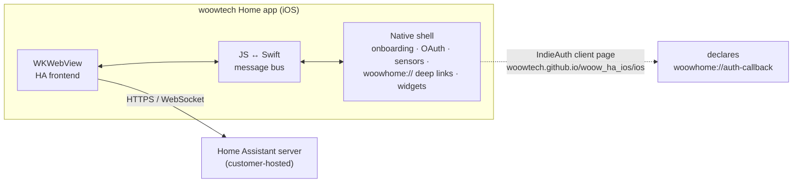
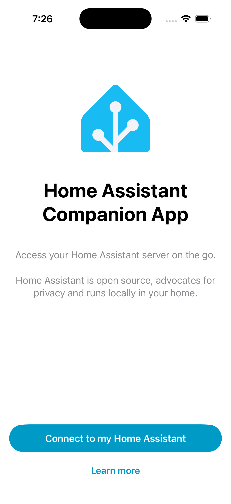
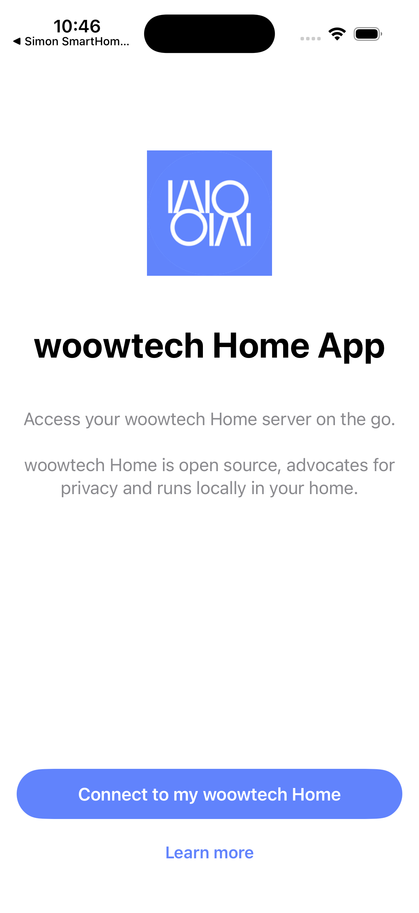

<p align="center">
  
</p>

<h1 align="center">woowtech Home — iOS App</h1>

<p align="center">
  <strong>White-label Home Assistant companion app for the woowtech Home ecosystem</strong><br/>
  iOS counterpart of <a href="https://github.com/WOOWTECH/woow_ha_app">woow_ha_app</a> (Android)
</p>

<p align="center">
  <a href="#overview">Overview</a> &bull;
  <a href="#architecture">Architecture</a> &bull;
  <a href="#screenshots">Screenshots</a> &bull;
  <a href="#building">Building</a> &bull;
  <a href="#verification-status">Verification</a> &bull;
  <a href="README_zh-TW.md">中文文件</a>
</p>

<p align="center">
  
  
  
  
</p>

---

## Overview

**woowtech Home iOS** is a white-label build of the official
[Home Assistant Companion app](https://github.com/home-assistant/iOS), produced by the
one-shot rebrand toolkit in the shared base
[`woow_ha_ios`](https://github.com/WOOWTECH/woow_ha_ios) — the same pipeline that built
[`Woow_simon_ha_ios`](https://github.com/WOOWTECH/Woow_simon_ha_ios) and
[`Woow_apporo_ha_ios`](https://github.com/WOOWTECH/Woow_apporo_ha_ios).
A native Swift shell (onboarding, OAuth, sensors, deep links, widgets) wraps the
Home Assistant web frontend served by the customer's own server.

| | |
|---|---|
| **Bundle ID** | `com.woowtech.home` (Release) / `com.woowtech.home.dev` (Debug) — aligned with Android |
| **URL scheme** | `woowhome://` (deep links + OAuth callback) |
| **OAuth client** | `https://woowtech.github.io/woow_ha_ios/ios` — **own identity**, unlike the Android build which still rides on upstream's `homeassistant://` + official client_id; Android should migrate to match |
| **Brand color** | `#6183FC` |
| **Upstream pin** | `home-assistant/iOS` tag `release/2026.7.3/2026.2546` |

## Architecture



The client_id page (hosted on the base repo's GitHub Pages) is what Home Assistant
servers validate the OAuth redirect against — it is live and declares
`woowhome://auth-callback`. Fork topology, toolkit design, and environment notes:
see the base repo's [README](https://github.com/WOOWTECH/woow_ha_ios#readme).
Divergence from upstream is ledgered in [`docs/fork-divergence.md`](docs/fork-divergence.md).

## Screenshots

| Upstream baseline | woowtech onboarding |
|---|---|
|  |  |
| The unmodified upstream app built from the pinned tag (toolchain baseline). | After the one-shot rebrand: woowtech mark, name, copy, `#6183FC` accent — brand-clean native shell. |

## Building

Same environment as all brands in this family (details in the
[base repo](https://github.com/WOOWTECH/woow_ha_ios#local-build-environment)):
Xcode 26.6+, watchOS platform downloaded, Homebrew CocoaPods (+`cocoapods-acknowledgements`),
swiftlint/swiftformat.

```bash
pod install
DEVELOPER_DIR=/Applications/Xcode.app/Contents/Developer \
xcodebuild -workspace HomeAssistant.xcworkspace -scheme App-Debug \
  -destination 'platform=iOS Simulator,name=iPhone 17' build
```

## Verification Status

| Stage | Status |
|---|---|
| Rebrand (3 934 strings / 34 locales, 79 asset sets) + preflight 66/66 | ✅ 2026-08-16 |
| Simulator build + branded onboarding | ✅ 2026-08-16 |
| Live server OAuth end-to-end (own client_id accepted, `woowhome://` redirect, dashboard, deep link) | ✅ 2026-08-16 ([report](docs/verification/phase4-report.md)) |
| Physical device + 8-category smoke | ⏳ pending |

**Known gap**: the app icon is temporarily upscaled from the Android 192 px launcher
asset — swap in the original 1024 px art via `Tools/brand/assets/woowtech-icon.png`
and re-run the icon step when available.

## License & Attribution

Modified distribution of Home Assistant Companion for iOS, © Home Assistant
contributors — [Apache License 2.0](LICENSE.md). Upstream attribution and the in-app
open-source acknowledgements page are preserved.
